# Chainer-disentanglement-lib
This repository collects Chainer implementations of state-of-the-art methods for unsupervised disentangled representation learning.  
Codes were evaluated quantitatively and qualitatively on dSprites[13] and mpi3d_toy[14] dataset.  


# How to use

### Clone repository and install requirements

```
git clone git@github.com:pfnet-research/chainer_disentanglement_lib.git
cd chainer_disentanglement_lib
```

#### a) Install requirements via `requirements.txt`
This repository is tested on Python 3.6.8.

Required python packages are listed in `requirements-gpu.txt`.
Note that you may need to install additional libraries manually, such as cuda.

```
pip install -r requirements-gpu.txt  # or, requirements-cpu.txt if your machine does not have any GPU
```


#### b) Build Docker image
`Dockerfile` contains all dependencies needed for this repository.

```
# Don't miss the final dot!
docker build -t <your_image_name> -f Dockerfile-gpu .  # or, Dockerfile-cpu if your machine does not have any GPU
```

Commands below should be run on the docker container's console. (`docker run -it -v `pwd`:/home/jovyan/chainer_disentanglement_lib <your_image_name> /bin/bash`)

### Set up environment and prepare datasetss

Download [dSprites](https://github.com/deepmind/dsprites-dataset) dataset and 
[mpi3d_toy](https://github.com/rr-learning/disentanglement_dataset) dataset.  
```
source bin/set_environ.sh
bash bin/download_dsprites.sh
```

You can change model save path and dataset path.
```
export OUTPUT_PATH=<your_output_path>
export DISENTANGLEMENT_LIB_DATA=<your_dataset_path>
```

You can set experiment name and dataset name to use.  
```
# Enter the name of your experiment
# training script will make directory ${OUTPUT_PATH}/${EVALUATION_NAME}
export EVALUATION_NAME=dev_tmp
# Enter the name of dataset to use
export DATASET_NAME=dsprites_full
# export DATASET_name=mpi3d_toy
```

`DATASET_NAME` has several options if you have additional datasets. For more detail, follow instructions described in [disentanglement_lib/disentanglement_lib/data/ground_truth/named_data.py](https://github.com/google-research/disentanglement_lib/blob/master/disentanglement_lib/data/ground_truth/named_data.py) and [disentanglement_lib/bin/dlib_download_data](https://github.com/google-research/disentanglement_lib/blob/master/bin/dlib_download_data).

### Training
You can start training with `train.py`.  

```
# please set `--device -1` on CPU-only machines.
python3 train.py --vae FactorVAE --device 0 --training_steps 1000
```

Please see `bin/example.sh` for other options.

### Evaluation
chainer_disentanglement_lib supports evaluating some "disentanglement score"s.  
Evaluation script is derived from [Disentanglement Challenge Starter Kit](https://github.com/AIcrowd/neurips2019_disentanglement_challenge_starter_kit/blob/master/local_evaluation.py), originated in [disentanglement_lib](https://github.com/google-research/disentanglement_lib/tree/master/disentanglement_lib/evaluation).

Note that evaluation process may take about 1 hour.  
```
# this script evaluate the model in
# ${OUTPUT_PATH}/${EVALUATION_NAME}/representation
# metrics will be evaluated by the ${DATASET_NAME} dataset
# local_scores.json wil be made in ${OUTPUT_PATH}/${EVALUATION_NAME}
python3 local_evaluation.py
```

# Reproduction
chainer_disentanglement_lib has been tested with the following environment.  
```
Docker base image nvidia/cuda:10.0-cudnn7-runtime-ubuntu18.04
Python 3.6.8
chainer 6.3.0
cupy-cuda100 6.3.0
numpy 1.16.3
Pillow 6.0.0
# for metric calculation
tensorflow-gpu 1.13.1
tensorflow-probability 0.6.0
gin-config 0.1.4
```

Implementations for BetaVAE, FactorVAE, DIPVAE-1/2 have been tested with [cars3d](https://papers.nips.cc/paper/5845-deep-visual-analogy-making) dataset.
From the result, chainer_disentanglement_lib can be say to reproduce the results of [disentanglement_lib](https://github.com/google-research/disentanglement_lib)'s implementation.

Following table shows the comparison between our implementation and `disentanglement_lib`.  
Each model was trained on 50 different seeds and evaluated on 5 disentanglement metric scores.

|model|quantitative comparison on cars3d dataset (left: **ours**, right: `disentanglement_lib`)|
|:-:|:-:|
|BetaVAE[2]|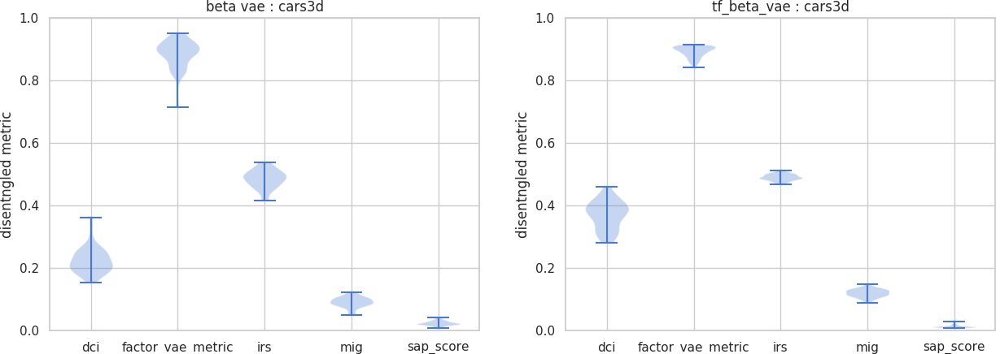|
|FactorVAE[3]|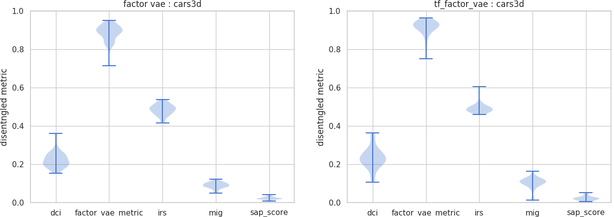|
|DIPVAE-1[5]|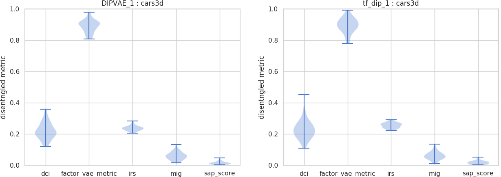|
|DIPVAE-2[5]|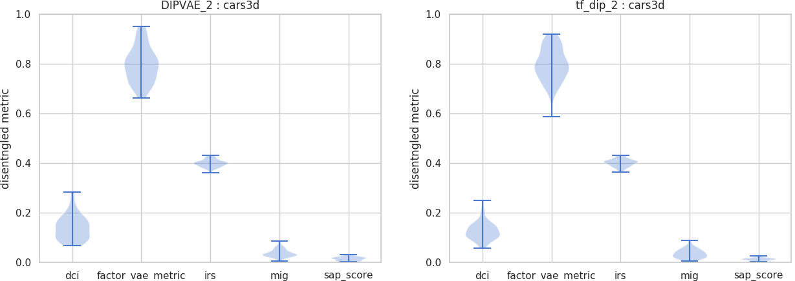|

Implementation for JointVAE has been tested with dSprites dataset.  
As in [the original JointVAE paper](https://arxiv.org/abs/1804.00104), outliers where the model collapsed to the mean are removed.  
The model was trained on 10 different seeds and evaluated on 5 disentanglement metric scores.  
The result shows that our implementation reproduce the original performance.

|model| **ours** | reported average score in [the original paper](https://arxiv.org/abs/1804.00104) |
|:-:|:-:|:-:|
|JointVAE[6]|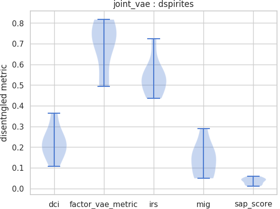| factor_vae_metric: 0.69|


# Quantitative evaluation
|dSprites|mpi3d_toy|
|----------|---------------|
|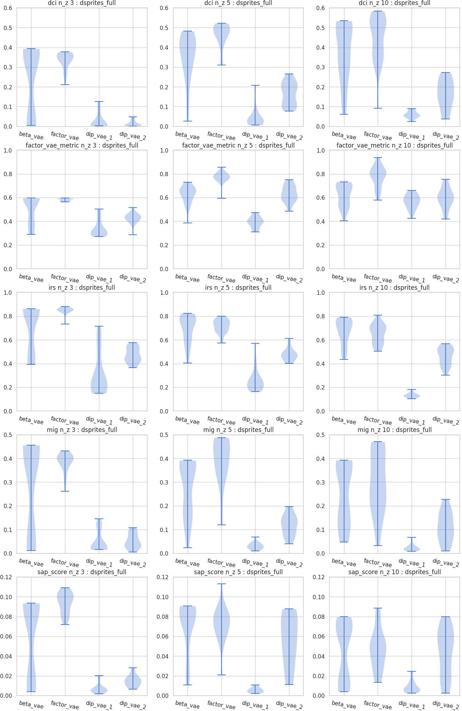|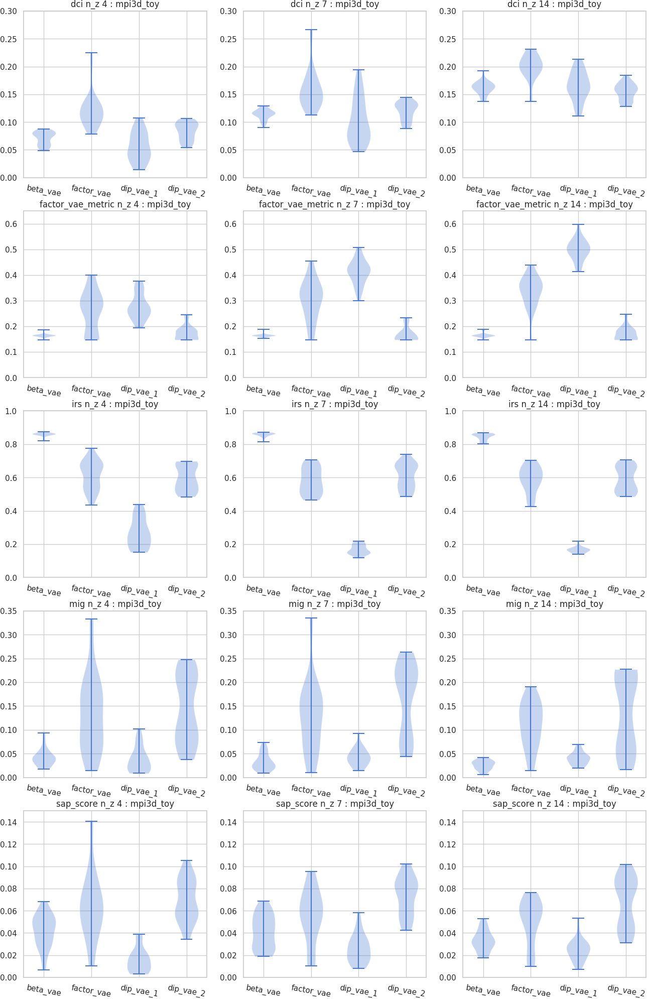|


# Qualitative evaluation
The image on the most left is the source image and second left one is its reconstruction image by the model.  
Other animated images show latent traversals of the encoded latent vector.  
For each latent traversal, only one dimension of the latent vector is changed from -1.5 to 1.5.

Notice that some latent dimension seems to represent "disentangled" factor of the dataset, namely, x-position/y-position/rotation/shape/scale.

## dSprites
### latent dimension size == 5
- Beta VAE  


- Factor VAE  
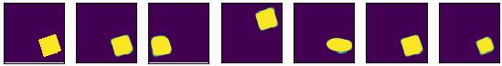

- DIP VAE 1  
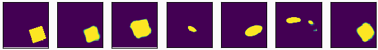

- DIP VAE 2  
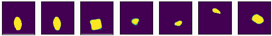

### latent dimension size == 10
- Beta VAE  


- Factor VAE  
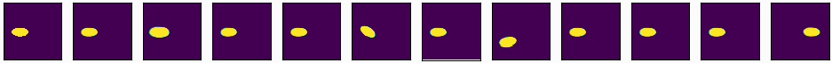

- DIP VAE 1  
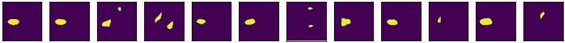

- DIP VAE 2  


## mpi3d_toy
### latent dimension size == 7
- Beta VAE  
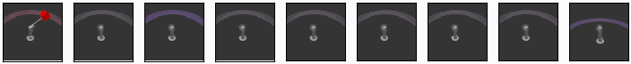

- Factor VAE  
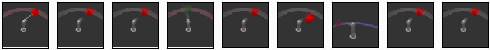

- DIP VAE 1  
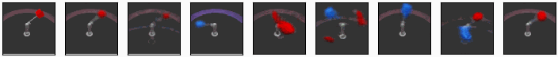

- DIP VAE 2  
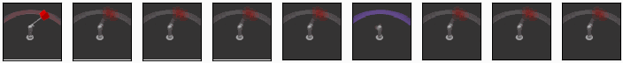

### latent dimension size == 14
- Beta VAE  
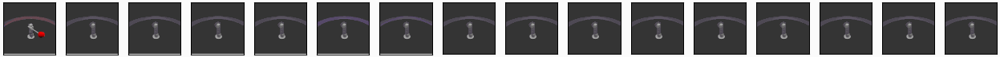

- Factor VAE  
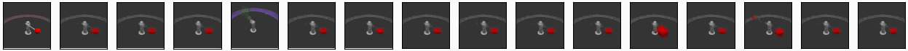

- DIP VAE 1  
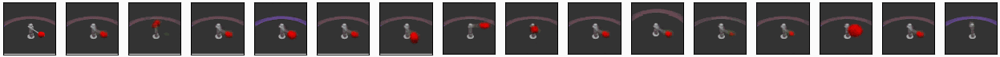

- DIP VAE 2  
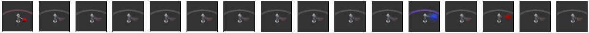

License
-------
(MIT License. Please see the LICENSE file for details.)

# References
- [1] Kingma & Welling, 2014, [Auto-Encoding Variational Bayes](https://arxiv.org/pdf/1312.6114.pdf)
- [2] Higgins et al., 2017, [β-VAE: LEARNING BASIC VISUAL CONCEPTS WITH A CONSTRAINED VARIATIONAL FRAMEWORK](https://openreview.net/references/pdf?id=Sy2fzU9gl)
- [3] Kim & Mnih, 2018, [Disentangling by Factorising](https://arxiv.org/abs/1802.05983)
- [4] Chen et al., 2018, [Isolating Sources of Disentanglement in Variational Autoencoders](https://arxiv.org/pdf/1802.04942.pdf)
- [5] Kumar et al. 2018, [Variational Inference of Disentangled Latent Concepts from Unlabeled Observations](https://arxiv.org/pdf/1711.00848.pdf)
- [6] Dupont, 2018, [Learning Disentangled Joint Continuous and Discrete Representations](https://arxiv.org/abs/1804.00104)
- [7] Jeong & Song, 2019, [Learning Discrete and Continuous Factors of Data via Alternating Disentanglement](http://arxiv.org/abs/1905.09432)
- [8] Do and Tran, 2019, [Theory and Evaluation Metrics for Learning Disentangled Representations](https://deepai.org/publication/theory-and-evaluation-metrics-for-learning-disentangled-representations)
- [9] Suter et al., 2019, [Robustly Disentangled Causal Mechanisms: Validating Deep Representations for Interventional Robustness](https://arxiv.org/pdf/1811.00007.pdf)
- [10] Eastwood & Williams, 2018, [A FRAMEWORK FOR THE QUANTITATIVE EVALUATION OF DISENTANGLED REPRESENTATIONS](https://openreview.net/pdf?id=By-7dz-AZ)
- [11] Locatello et al., 2018, [Challenging Common Assumptions in the Unsupervised Learning of Disentangled Representation](https://arxiv.org/abs/1811.12359)
- [12] Mathieu et al., 2019 [Disentangling Disentanglement in Variational Autoencoders](https://arxiv.org/pdf/1812.02833.pdf)
- [13] Loic et al., 2017, [dSprites: Disentanglement testing Sprites dataset](https://github.com/deepmind/dsprites-dataset/)
- [14] Gondal et al., 2019, [On the Transfer of Inductive Bias from Simulation to the Real World: a New Disentanglement Dataset](https://github.com/rr-learning/disentanglement_dataset)
